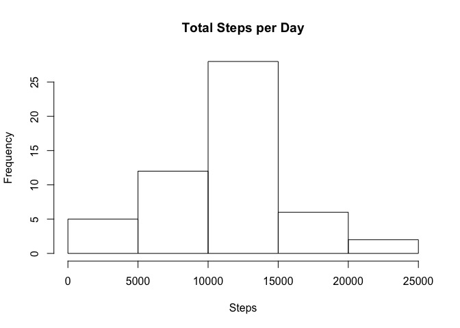
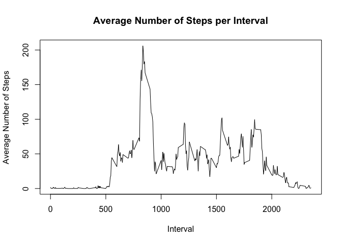
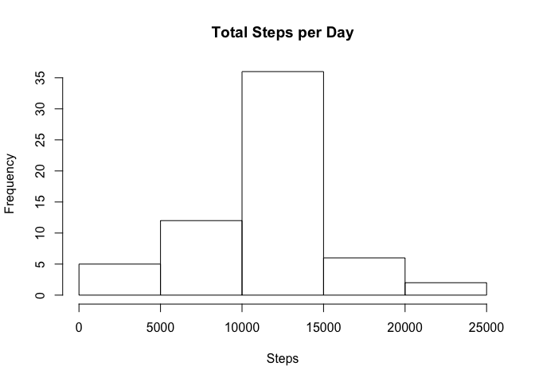
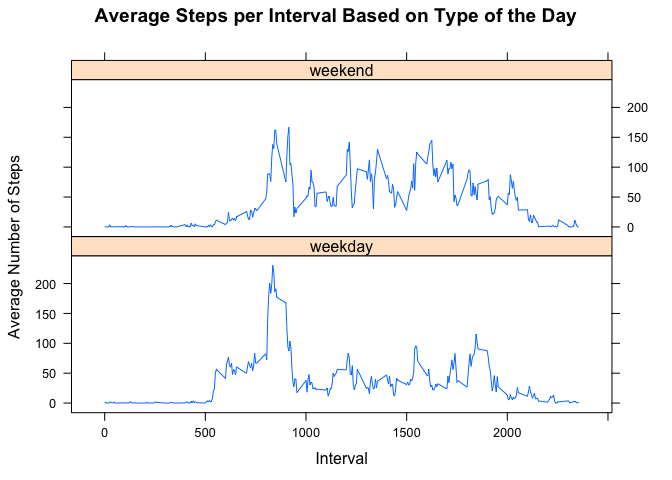

# Reproducible Research: Peer Assessment 1


## Loading and preprocessing the data


```r
#Loading packages
library(plyr)
library(ggplot2)
library(lattice) 
#Loading data
activity_data  <- read.csv(unz("activity.zip", "activity.csv"))
#Preprocess
activity_data$date <- as.Date(activity_data$date)
clean_data <- activity_data[!is.na(activity_data$steps),]
options(scipen = 1, digits = 2)
```


## What is mean total number of steps taken per day?


```r
total_steps <- aggregate(list(steps=clean_data$steps),by=list(date=clean_data$date), FUN=sum)
hist(total_steps$steps, breaks=5, xlab="Steps", main = "Total Steps per Day")
```

<!-- -->

```r
median_steps <- median(total_steps$steps)
mean_steps <- mean(total_steps$steps)
```

Mean total number of steps taken per day is 10766.19.  
Median total number of steps taken per day is 10765.

## What is the average daily activity pattern?


```r
intervals <- ddply(clean_data, .(interval), summarize, average = mean(steps))
plot( intervals$interval, intervals$average, type="l",main="Average Number of Steps per Interval",ylab="Average Number of Steps",xlab="Interval")
```

<!-- -->

```r
max_interval <- intervals$interval[which(intervals$average == max(intervals$average))]
```

Which 5-minute interval, on average across all the days in the dataset, contains the maximum number of steps? It is the interval 835.

## Imputing missing values


```r
num_na <- sum(is.na(activity_data$steps))
```
Total number of missing values in the dataset is 2304.  

##### "Strategry used for imputing missing values is substituting the missing steps with the mean for that 5-minute interval.""


```r
# Strategry:  substitute the missing steps with the mean for that 5-minute interval.
activity_data2<- activity_data
activity_data2$steps[is.na(activity_data2$steps)] <- intervals[match(activity_data2$interval,intervals$interval),2]
total_steps2 <- aggregate(list(steps=activity_data2$steps),by=list(date=activity_data2$date), FUN=sum)
hist(total_steps2$steps, breaks=5, xlab="Steps", main = "Total Steps per Day")
```

<!-- -->

```r
median_steps2 <- median(total_steps2$steps)
mean_steps2 <- mean(total_steps2$steps)
```

Mean total number of steps taken per day is 10766.19.  
Median total number of steps taken per day is 10766.19.  

Mean doesn't chenge, beacuse I used mean values for the NA's. Median in increased from 10765 to 10766.19. Median became more closer to the mean. Mean is equal to median, that means the distribution is symmetric.

## Are there differences in activity patterns between weekdays and weekends?


```r
activity_data2$day_type<- ifelse(weekdays(activity_data2$date)%in% c('Saturday','Sunday') ,"weekend","weekday")
intervals2 <- ddply(activity_data2, .(interval, day_type), summarize, average = mean(steps))
xyplot(average~interval|day_type, data=intervals2 , type="l",  layout = c(1,2),
       main="Average Steps per Interval Based on Type of the Day", 
       ylab="Average Number of Steps", xlab="Interval")
```

<!-- -->

The activity patterns are different between weekdays and weekends. Looks like people have more opportunity for being active during the day on weekends. In weekdays, people are more active in the morning and evening, but less active during the work hours.
